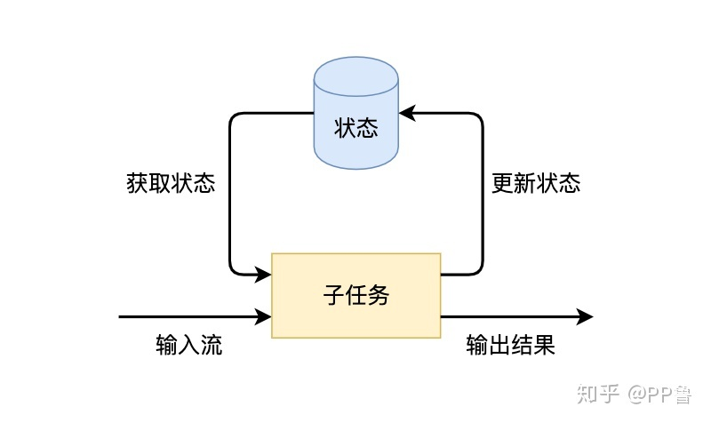

# Flink 状态管理
## 一、为什么需要状态管理
流计算需求中普遍存在需要状态管理的场景，抽象来说：
1. 有状态的：代表同一个输入会产生不同的输出。
2. 无状态的：代表同一个输入只会产生相同输出。

举几个例子：    
+ 例子1：flink 里面的 map、flatmap、filter 等算子都是无状态的，只要是相同的输入都会有相同的结果。
+ 例子2：类似 reduce 函数，即使相同的操作，它也可能有不同的结果，因为结果会和之前的状态进行联合计算再输出。
+ 例子3：计算用户数，需要将当前用户和之前的所有用户进行去重得到真正访问的人数，这个就需要我们知道以前的状态。

在 Flink 的执行原理层面，一个 Operator 对应多个 subtask，每个 subtask 运行在不同的 slot 里面，这里可以
把状态理解为 subtask 在当前线程 slot 里面的一个变量，变量记录了数据历史信息，当新输入流入的时候，会快速结合历史信息
进行综合比较计算得到新的结果，并且更新这个状态变量的值。实际上，Flink 的状态就是由 subtask 来创建和管理的。一个状态
更新和获取的流程如下图所示：    


## 二、状态管理的挑战
从这个流程来看，状态管理流程并不复杂，但是在流计算场景，状态管理不仅仅要满足更新状态的任务，还需要满足：
1. 状态读取和更新时间延迟不能太高，因为流计算对实时性要求本身就很高。
2. 需要保证数据恰好计算一次 (Exactly Once)，尤其是当状态数据非常大或者应用出现故障需要恢复时，需要保证状态计算不出错。
3. 流处理任务都是 7*24 小时运行的，程序可靠性要求很高。

基于上述要求，不能将状态直接交由内存管理，因为内存容量是有限的，当状态数据稍微大一点时，就会出现 OOM 问题。
假如使用一个持久化备份系统，不断将内存中的状态备份起来，当流处理作业出现故障时，还需要考虑如何从备份中快速恢复。
而且，大数据应用一般是横向分布在多个节点上，流处理框架需要保证横向伸缩扩展性。可见，状态的管理并不那么容易。

## 三、Flink的几种状态类型
+ 按照状态管理者来分，可以分为：Managed State 和 Raw State
Managed State 是由 Flink 框架管理的，Flink 帮忙存储、恢复和优化，Raw State是开发者自己管理的，需要自己序列化。具体来说：

| |Managed State|Raw State|
| :-----| :----: | :----: |
|状态管理方式|Flink Runtime 托管，自动存储、自动恢复、自动伸缩|用户自己管理|
|状态数据结构|Flink 提供常用的数据结构，如：ListState、MapState、ValueState |只支持字节数组，自己序列化和反序列化|
|使用场景|绝大多数有状态的算子|用户自定义，实际很少用|

下面重点介绍，Managed State
+ 按照使用方式来分，Managed State 又可以分为：Keyed State 和 Operator State，而 Raw State 只有 Operator State。    

具体来看：
+ Keyed State：KeyedStream 上的状态。假如输入流按照 keyId 为 Key 进行 keyBy 分组，形成一个 KeyedStream，
数据流中所有 keyId = 1 的数据共享一个状态，可以访问和更新这个状态，以此类推，每个 Key 对应一个自己的状态。
因为一个 subtask 可以处理一到多个 Key，如果 subtask 处理了两个 Key，两个 Key 就会分别对应自己的状态。
+ Operator State：可以用在所有 operator 上，每个 operator 或者说每个算子实例共享一个状态，流入这个 operator 的数据可以访问和更新这个状态。    

下面通过一个表格详细对比一下：

| |Keyed State|Operator State|
| :-----| :----: | :----: |
|适用算子类型|只适用于 KeyedStream 上，KeyBy 后|可以用户所有 Operator|
|状态分配方式|每个 Key 都对应一个状态 |每个 Operator 都对应一个状态|
|创建访问方式|重写 Rich Function，通过 RuntimeContext 操作|实现 CheckpointedFunction|
|横向扩展能力|状态随着 key 自动在多个算子子任务上迁移|有多种状态重新分配的方式|
|支持数据结构|ValueState、ListState、MapState等|ListState、BroadcastState等|


## 四、Keyed State的使用方法
对于 Keyed State，Flink 提供了几种现成的数据结构供用户使用，包括 ValueState、ListState 等，继承关系如下 State 主要有三种实现，分别为 ValueState、MapState 和 AppendingState，
AppendingState 又被实现为 ListState、ReducingState 和 AggregatingState。

这几个状态的具体区别在于：

+ ValueState[T]是单一变量的状态，T是某种具体的数据类型，比如Double、String，或我们自己定义的复杂数据结构。我们可以使用value()方法获取状态，使用update(value: T)更新状态。
+ MapState[K, V]存储一个Key-Value map，其功能与Java的Map几乎相同。get(key: K)可以获取某个key下的value，put(key: K, value: V)可以对某个key设置value，contains(key: K)判断某个key是否存在，remove(key: K)删除某个key以及对应的value，entries(): java.lang.Iterable[java.util.Map.Entry[K, V]]返回MapState中所有的元素，iterator(): java.util.Iterator[java.util.Map.Entry[K, V]]返回一个迭代器。需要注意的是，MapState中的key和Keyed State的key不是同一个key。
+ ListState[T]存储了一个由T类型数据组成的列表。我们可以使用add(value: T)或addAll(values: java.util.List[T])向状态中添加元素，使用get(): java.lang.Iterable[T]获取整个列表，使用update(values: java.util.List[T])来更新列表，新的列表将替换旧的列表。
+ ReducingState[T]和AggregatingState[IN, OUT]与ListState[T]同属于MergingState[T]。与ListState[T]不同的是，ReducingState[T]只有一个元素，而不是一个列表。它的原理是新元素通过add(value: T)加入后，与已有的状态元素使用ReduceFunction合并为一个元素，并更新到状态里。AggregatingState[IN, OUT]与ReducingState[T]类似，也只有一个元素，只不过AggregatingState[IN, OUT]的输入和输出类型可以不一样。ReducingState[T]和AggregatingState[IN, OUT]与窗口上进行ReduceFunction和AggregateFunction很像，都是将新元素与已有元素做聚合。


## 五、Operator State的使用方法
目前 Operator State 主要有三种，其中 ListState 和 UnionListState 在数据结构上都是一种 ListState，还有一种 BroadcastState。
这里主要介绍 ListState 这种列表形式的状态。这种状态以一个列表的形式序列化并存储，以适应横向扩展时状态重分布的问题。
每个 subtask 有零到多个状态S，组成一个列表 ListState[S]。各个算子子任务将自己状态列表的 snapshot 到存储，
整个状态逻辑上可以理解成是将这些列表连接到一起，组成了一个包含所有状态的大列表。
当作业重启或横向扩展时，需要将这个包含所有状态的列表重新分布到各个算子子任务上。    
ListState 和 UnionListState 的区别在于：ListState 是将整个状态列表按照 round-robin 的模式均匀分布到各个算子子任务上，
每个算子子任务得到的是整个列表的子集；UnionListState 按照广播的模式，将整个列表发送给每个算子子任务。
Operator State 的实际应用场景不如 Keyed State 多，它经常被用在 Source 或 Sink 等算子上，
用来保存流入数据的偏移量或对输出数据做缓存，以保证 Flink 应用的Exactly-Once语义。
这里来看一个 Flink 官方提供的 Sink 案例来了解 CheckpointedFunction 的工作原理。

```java
public class BufferingSink
        implements SinkFunction<Tuple2<String, Integer>>,
                   CheckpointedFunction {

    // 达到一定的阈值开始输出
    private final int threshold;

    // 当前状态保持最后一批还没有输出的数据
    private transient ListState<Tuple2<String, Integer>> checkpointedState;

    // 本地缓存的数据
    private List<Tuple2<String, Integer>> bufferedElements;

    public BufferingSink(int threshold) {
        this.threshold = threshold;
        this.bufferedElements = new ArrayList<>();
    }

    @Override
    public void invoke(Tuple2<String, Integer> value, Context ctx) throws Exception {
        // 一个 subtask 不断收集数据
        bufferedElements.add(value);
        if (bufferedElements.size() == threshold) {
            // 假如达到阈值就输出
            for (Tuple2<String, Integer> element: bufferedElements) {
                // send it to the sink
            }
            bufferedElements.clear();
        }
    }

    @Override
    public void snapshotState(FunctionSnapshotContext context) throws Exception {
        // 定期保持还没有输出的数据
        checkpointedState.clear();
        for (Tuple2<String, Integer> element : bufferedElements) {
            checkpointedState.add(element);
        }
    }

    @Override
    public void initializeState(FunctionInitializationContext context) throws Exception {
        // 如果发生故障重启，就将之前还没有输出的数据重新读出来接着添加数据
        // 数据恢复时候有可能获取到的数据是随机的，故障发生时候每个 subtask 都有部分没有输出的数据
        // 故障恢复时候就按 rb 方式发送到每个 subtask。
        ListStateDescriptor<Tuple2<String, Integer>> descriptor =
            new ListStateDescriptor<>(
                "buffered-elements",
                TypeInformation.of(new TypeHint<Tuple2<String, Integer>>() {}));

        checkpointedState = context.getOperatorStateStore().getListState(descriptor);

        if (context.isRestored()) {
            for (Tuple2<String, Integer> element : checkpointedState.get()) {
                bufferedElements.add(element);
            }
        }
    }
}
```